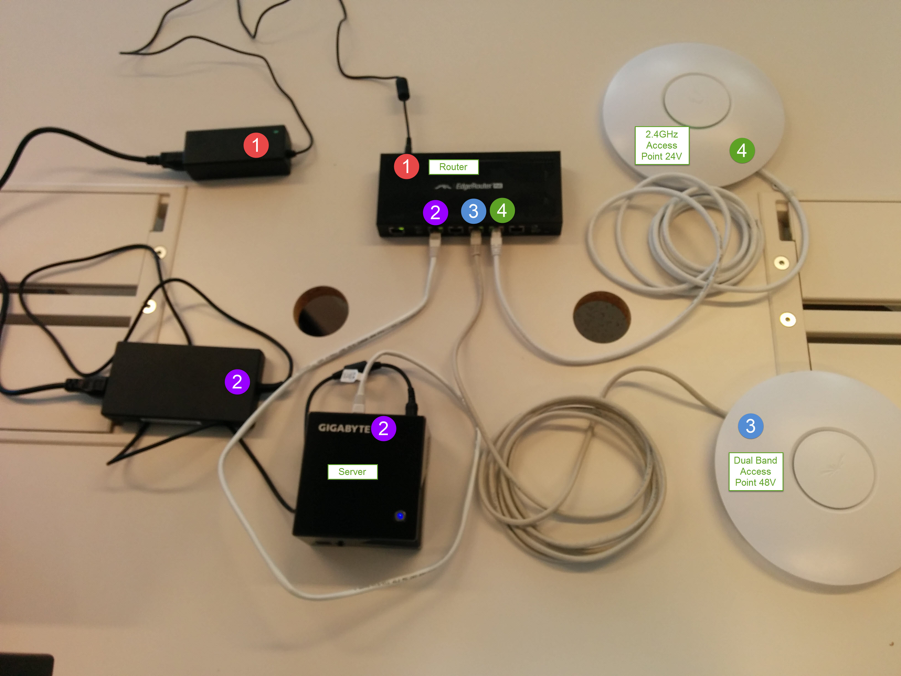
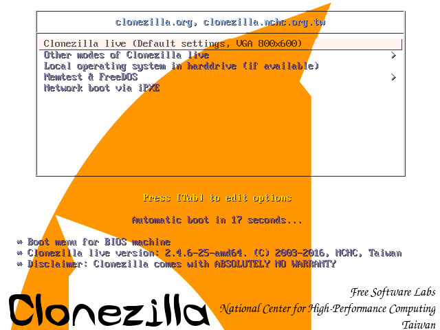
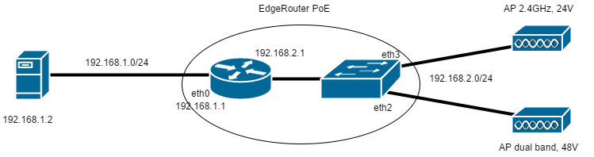

# DHIS2 Academy Setup Guide

This is a guide for setting up a DHIS2 Academy Server. It includes setting up one or more DHIS2 instances and Moodle. It is recommended to have at least 8GB RAM and an SSD.

**This guide should be updated and sent out with the server to reflect the setup of the server. This means including information on all the DHIS2 instances if there are more than one etc.**

## Content

1. [Intro](#intro)
2. [Credentials](#credentials)
3. [General Information](#general-information)
4. [Setup using Clonezilla](#setup-using-clonezilla)
5. [Setup from scratch](#setup-from-scratch)
6. [Network](#network)
7. [Troubleshooting](#troubleshooting)

## Intro

This guide is split in two parts, the first part is the easy setup where you copy an existing harddisk image to your servers harddisk. The second part describes in detail how to set up a new server fresh.
Configuration files are located [here](https://github.com/simjes/academy).

## Credentials

If you have a DHIS2 Academy server from earlier than `21.05.2016` these credentials might be different, check documents you recieved with the server.
This is the standard configuration. Remember to update if there are more DHIS2 instances etc.

Service                          | Format                     | Credentials
-------------------------------- | -------------------------- | --------------------------------
Ubuntu Server (logon/ssh)        | username:password          | dhisadmin:dhis
Postgres root                    | command                    | sudo -u postgres psql postgres
DHIS2 instance and database name | name                       | dhis
Moodle admin user                | username:password          | admin:DHIS4ever!
Moodle Postgres                  | username:database:password | moodleuser:moodle:dhis
Router Admin                     | username:password          | ubnt:ubnt
UniFi controller                 | username:password          | dhis:dhis
WiFi                             | SSID (no password)         | dhis2

## General Information

- Server IP: 192.168.1.2
  - Can ssh to it using `ssh dhisadmin@192.168.1.2`.
- Domain: dhis.academy
- Access server through <http://192.168.1.2> or <http://dhis.academy>
- Router admin panel can be accessed through <http://192.168.1.1>
- Web content is located at `/var/www/`
- Clients (connected via WiFi or on port eth4) will be on the 192.168.2.0/24 subnet.

### Logs

- Postgresql: `/var/log/postgresql-9.3-main.log`
- DHIS2: `/var/lib/dhis2/<instance name>/logs/*`
- Nginx: `/var/log/nginx/*`
- Router and access point logs can be downloaded by running `./StandardConfig/getLogs.sh`. This will ask for the passwords of the devices the logs will be downloaded from, check the [credentials](#credentials).

### Equipment

**The equipment will be marked with numbers, it is important that only the matching numbers are connected!**

Equipment                                     | Marked
--------------------------------------------- | -----:
EdgeRouter PoE, including power adapter (48V) |     #1
Server, including power adapter				  |     #2
WiFi Access Point Dual Band                   |     #3
WiFi Access Point 2.4GHz                      |     #4
Ethernet cables x3                            |      -

**All of the equipment is marked with numbers, only connect the corresponding numbers so that the equipment is not damaged.**



## Setup using Clonezilla

Setting up an academy server using this part of the guide will require you to clone an existing server image onto your server using Clonezilla.

> The destination partition must be equal or larger than the source one.

Requirements:

- The Ubuntu HDD Image:
  - [Dropbox](https://www.dropbox.com/sh/epyf0vgpxidjvxv/AACUUUDo2jzGrxjUCl7QywaLa?dl=0) (256GB image, Ubuntu 14.04)
- Clonezilla live USB:
  - [Make a bootable USB](http://clonezilla.org/liveusb.php)

This will mostly be explained in pictures. You will need a bootable Clonezilla USB memory stick and a USB memory stick containing the SSD image (or get it from a SSH server). The pictures will show how to do it using a USB memory stick, but if you want to use a SSH server you can choose that option instead, the program guides you though the process.

Boot the server from the Clonezilla USB stick, choose default settings and then keyboard layout. Continue following the onscreen instructions or click the picture below for full picture guide.

[](StandardConfig/images/clonezilla_setup/)

## Setup from scratch

For this method you can find configurations in the [academy github repository](https://github.com/simjes/academy). When the guide asks you to copy configuration files, the root will be this folder.

### Server setup

1. Download Ubuntu Desktop LTS 14.04 or 16.04
  - Can use Ubuntu Server as well.
2. Install it to a USB drive:
  - [for Windows](http://www.linuxliveusb.com)
  - [for Mac OSX](https://goo.gl/fgoM5R)
3. Install Ubuntu on the server, use:
  - Username: dhisadmin
  - Password: dhis
  - Hostname: academyserver
4. Install SSH, Postgresql and Nginx using the terminal:

  ```bash
  sudo apt-get install ssh
  sudo apt-get install postgresql
  sudo apt-get install nginx
  ```

### DHIS2 Instance setup

This is a guide for setting up a general DHIS2 academy server. The server will run one DHIS2 instance and Moodle. If you want to add multiple instances or additional services Nginx needs to be configured to handle this.

#### Installing the dhis2-tools

##### Option 1

Install git and clone the dhis2-tools repository. Install the tools using the provided script.

  ```bash
  sudo apt-get install git
  git clone https://github.com/dhis2/dhis2-tools.git
  cd dhis2-tools
  sudo ./install.sh
  ```

##### Option 2

1. Install Java8

  ```bash
  sudo add-apt-repository ppa:webupd8team/java
  sudo apt-get update
  sudo apt-get install oracle-java8-installer
  ```

2. Install dhis2-tools

  ```bash
  sudo add-apt-repository ppa:simjes91/dhis2-tools
  sudo apt-get update
  sudo apt-get install dhis2-tools
  ```

#### Postgres configuration

1. Copy `StandardConfig/postgres/dhis-postgres.conf` into the main folder for Postgres. Should look similar to this `/etc/postgresql/9.3/main/dhis-postgres.conf`.
2. Incude the `dhis-postgres.conf` file in the `/etc/postgresql/9.3/main/postgres.conf`
  - Add the following line to the file: `include = 'dhis-postgres.conf'`

#### Set up a new DHIS2 instance

This method can be used to create multiple DHIS2 instances. In the guide only one instance will be set up. This guide uses the credentials described in the [credentials section](#credentials). For more information on the different commands see the man pages. Use `apropos dhis` to see which man pages are available.

1. Create a DHIS2 admin account.

  ```bash
  dhis2-create-admin dhisadmin
  ```

2. Create a new DHIS2 instance. The default port is 8080, you can change this by using the `-p portNumber` paramteter. Use the `-p` paramterer to create multiple instances, but remember to also configure Nginx for all the instances.

  ```bash
  dhis2-instance-create dhis
  ```

3. Configure the system to use HTTP instead of HTTPS. Edit `/var/lib/dhis2/<instance name>/conf/server.xml`. Change proxyport to `proxyport="80"` and scheme to `scheme="http"`.
4. (Optional) If you want to restore a database, do it before the next step. If you want an empty database, skip this step. Restoring a database is explained in [Restore a database to a DHIS2 instance](#restore-a-database-to-a-dhis2-instance)
5. Deploy a WAR file to the DHIS2 instance. The standard command will get the latest stable version, see the man pages for other options.

  ```bash
  dhis2-deploy-war dhis
  ```

6. Configure Nginx with `StandardConfig/nginx/academy.conf`

  ```bash
  sudo dhis2-nginx academy.conf
  ```

7. Create the web folder and copy the provided content from `StandardConfig/html/`.

  ```bash
  sudo mkdir /var/www
  sudo chgrp www-data /var/www
  sudo cp -r StandardConfig/html/* /var/www
  ```

You should now be able to access your DHIS2 instance in the web browser. Navigate to localhost and click the link to DHIS2\.
You can edit `/var/www/index.html` to fit your needs, for example if you have mutliple DHIS2 instances.

##### Restore a database to a DHIS2 instance

It is possible to use an existing database for a DHIS2 instance. Sample databases can be found at the [dhis2 download page](https://www.dhis2.org/downloads). Restore the database before deploying a WAR file.

  ```bash
  wget https://www.dhis2.org/download/resources/2.23/dhis2-demo.zip
  unzip dhis2-demo.zip
  dhis2-restoredb dhis demo.sql
  dhis2-startup dhis
  ```

### Moodle setup

Moodle will automatically set up using the provided script. To set up Moodle run:

  ```bash
  sudo ./StandardConfig/moodle/moodle_setup.sh
  ```

If you access Moodle through the IP address of the server or if you set up another domain than `www.dhis.acadaemy` you must change the `wwwroot`in `/var/www/moodle/config.php`.
Example of the standard configuration:

  ```php
  $CFG->wwwroot   = 'http://www.dhis.academy/moodle';
  ```

For details about the setup, check the original guide [here](https://goo.gl/eDV8kd) or look at the setup script.

#### Change user upload limit
The max upload size in Moodle is by default very low, this needs to be changed in multiple places to increase it. This guide will set the max upload size to 250MB. Edit the following files:
1. In `/etc/php5/fpm/php.ini` set the following parameters:
  - `post_max_size = 250M`
  - `upload_max_filesize = 250M`
Restart php by running `sudo service php5-fpm restart`
2. Change `Client_max_body_size 250M;` in the Nginx configuration, this is set to 250MB if you used the provided configuration. Change it in `/etc/nginx/sites-available/academy.conf` and reload the settings by running `sudo service nginx reload`.
3. You also have to change it in the Moodle settings:
  - Go to: Site admin -> Security -> Site policies. Change "maximum uploaded file size".
  - Go to: Site admin -> Plugins -> Activity modules -> assignments -> Submission plugins -> File submissions. Change the max upload size.

### DNS Setup
DNS server will be running on the server, in this guide we used `academyserver` as the hostname of the server. If you didn’t use `academyserver` as the hostname, replace it with your server’s hostname. The configuration files can be copied from `StandardConfig/dns/`.

1. Add the domain name to `/etc/hosts`:

	```
	127.0.0.1 localhost
	128.192.168.1.2 academyserver.dhis.academy academyserver
	```

2. Install Bind9

	```bash
	sudo apt-get install bind9
	```

3. Edit `/etc/bind/named.conf.local`. Add forward and reverse zone:

	```
	zone "dhis.academy" {
		type master;
        file "/etc/bind/db.dhis.academy";
    };
	zone "1.168.192.in-addr.arpa" {
    	type master;
    	file "/etc/bind/db.192";
    }
    ```

4. Create and fill in the files that the zones from step 3 points to
	a. `db.dhis.academy`:

        $TTL	604800
		@	IN	SOA	academyserver.dhis.academy. dhisadmin.dhis.academy. (
			      			4		; Serial
			 			604800		; Refresh
			  			86400		; Retry
						2419200		; Expire
			 			604800 )	; Negative Cache TTL
		;
		dhis.academy.	IN	NS	academyserver.dhis.academy.
		dhis.academy.	IN	A	192.168.1.2
		academyserver	IN	A	192.168.1.2
		www	IN	CNAME	dhis.academy.

	b. `db.192`:

    	$TTL	604800
		@	IN	SOA	academyserver.dhis.academy. dhisadmin.dhis.academy. (
			      			3		; Serial
			 			604800		; Refresh
			 			 86400		; Retry
						2419200		; Expire
			 			604800 )	; Negative Cache TTL
		;
				 IN	NS	academyserver.
		;@	   IN	NS	academyserver.
		2		IN	PTR	academyserver.dhis.academy.

5. Comment out or delete `include "/etc/bind/named.conf.default-zones";` from the `/etc/bind/named.conf` file.
For more information on the DNS setup click [here](http://askubuntu.com/questions/330148/how-do-i-do-a-complete-bind9-dns-server-configuration-with-a-hostname).


## Network


### Edgerouter PoE configuration
Detailed information and new firmware can be found [here](https://www.ubnt.com/download/edgemax/edgerouter-poe).

If the router has factory settings: set static IP on your computer, for example IP 192.168.1.100 and Default Gateway 192.168.1.1.  Connect your computer to the eth0 port on the Edgerouter and navigate to 192.168.1.1 in your browser. The username and password are both `ubnt`. Update the firmware of the router. If the router is preconfigured with our setup you will need to connect to eth4 to access the router and you do not have to set static IP.

The router configuration can be imported from `StandardConfig/edgerouter/`. When you import the settings remember to change the MAC address of where the static IP should be assigned , this is the servers MAC address. You can see an example [here](StandardConfig/images/routerscreens/change_hw_addr.png).

#### 192.168.1.0/24
  - Set static IP for the server: 192.168.1.2
  - Set the Gateway IP to 192.168.1.1, this will be on port eth0.

#### 192.168.2.0/24
  - Set Gateway IP to 192.168.2.1
  - Set DHCP for port eth2, eth3 and eth4.
    - Range 10-250
  - Set DNS to be 192.168.1.2 (the servers IP).
  - Set eth1, eth2 and eth3 to be switched.
  - Set eth2 to use PoE 48V.
  - Set eth3 to use PoE 24V.

You can find pictures of the settings [here](StandardConfig/images/routerscreens/).

### Access Point Configuration
To configure the access points, you need to use the UniFi controller that can be downloaded from [here](https://www.ubnt.com/download/unifi/). When it is installed, plug your computer into the router in port eth4 and start the UniFi controller program. The settings should be:
  - Update Firmware
  - Turn off DHCP
  - Set wireless SSID: dhis2
  - Set network to 192.168.2.1/24
  - The UniFi Pro (dual band) access point will have static IP 192.168.2.5
  - The UniFi 2.4GHz access point will have static IP 192.168.2.2

You can find pictures of the settings [here](StandardConfig/images/unifiscreens/).


## Troubleshooting
### DHIS2 and Nginx
Problem | Solution
------- | --------
When you attempt to access the site with your browser it does not connect. | Either there is a network problem or nginx is not running. Check first to see if you can ping the host. If not, you have a network problem. If you can ping the site, the most likely problem is that nginx is not installed or is not running. Verify that nginx is up and running and listening on ports 443 and 80 by typing: `sudo netstat -ntlp` You should see the nginx process listening on those 2 ports.
You can access the site but you see a 502 gateway error in your browser. | This means that nginx is unable to connect to your backend dhis2 instance. Either the instance is not running or your nginx location configuration has an error. Running the same netstat command above should show your instance listening on 127.0.0.1 with a port number typically 8080 or whatever you have configured it as. If it’s not running, try to start it with `dhis2-startup [instance name]`. If it is still not running, check the log file with `dhis2-logview [instance name]` to see if there is any information indicating why it has failed to start. If it is running and you can see it with netstat then you need to check your nginx configuration file to ensure that the location is correctly mapped.
You can access the site but you see a blank page in your browser. | This usually means that the dhis2 instance is running, but you have forgotten to deploy a war file to it. You need to run dhis2-deploy-war on that instance. See the reference section above for details of options.

###DHIS2 automatic startup
If the DHIS2 instances doesn't automatically start you can change the following: 
In the file located at `$JAVA_PATH/jre/lib/security/java.security` change `securerandom.source=file:/dev/urandom` to `securerandom.source=file:/dev/./urandom`.
More information about this bug [here](http://stackoverflow.com/questions/26431922/tomcat7-starts-too-late-on-ubuntu-14-04-x64-digitalocean).
